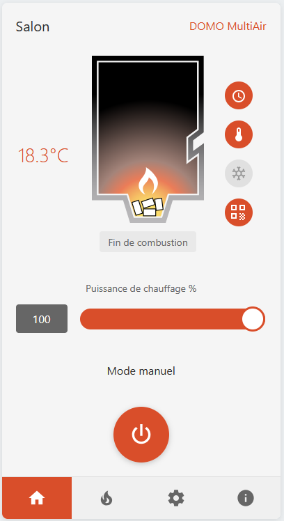

# 🔥 Rika Firenet Card

[![GitHub Release][releases-shield]][releases]
[![License][license-shield]](LICENSE)
[](https://github.com/custom-components/hacs)
[![Community Forum][forum-shield]][forum]

Custom card for Home Assistant that replicates the official Rika Firenet interface.

Perfect integration for your Rika pellet stove with the [Rika Firenet integration by Antibill51](https://github.com/antibill51/rika-firenet-custom-component).



---

## 📸 Screenshots

### Home Tab
Main interface with controls and real-time stove status.


<!-- Vous pouvez ajouter plus de screenshots ici :
### Flame Tab


### Settings Tab


### Info Tab

-->

---

## ✨ Features

### 🎨 Complete Interface
- **4 navigation tabs**: Home / Flame / Settings / Info
- **Dynamic SVG visuals** that change based on stove status
- **Faithful reproduction** of the official Rika Firenet app
- **Responsive design** (desktop, tablet, mobile)

### 🎮 Interactive Controls
- 🌡️ **Temperature control**: Click the thermometer icon to adjust target temperature
- 💪 **Power adjustment**: Slider from 30% to 100% (5% steps)
- 🔄 **Mode selection**: Cycle through Manual/Auto/Comfort modes
- ⚡ **Power button**: Central on/off control

### 📊 Complete Information Display
- Current and target temperature
- Real-time stove status
- Heating power
- Status icons (schedule, temperature, comfort, WiFi)
- Detailed information (runtime, consumption, maintenance)
- Diagnostics (motor, fan, ignition)

### 🔧 Easy Configuration
- Minimal configuration (just the climate entity)
- Complete configuration with all entities
- Smart default entity names
- Optional model parameter

## 📋 Prerequisites

- Home Assistant 2023.4+
- [Rika Firenet Integration](https://github.com/antibill51/rika-firenet-custom-component) by Antibill51
- Basic entities:
  - `climate.XXXX` (your Rika climate entity)
  - `sensor.XXXX_main_state`
  - `sensor.XXXX_sub_state`
  - `sensor.XXXX_room_temperature`

## 🚀 Installation

### Manual Installation

1. **Create the folder** `/config/www/rika-firenet-card/`

2. **Copy** the file `rika-firenet-card.js` to this folder

3. **Add the resource** in Home Assistant:
   - Go to **Settings** → **Dashboards** → **Resources**
   - Click **+ Add Resource**
   - URL: `/local/rika-firenet-card/rika-firenet-card.js`
   - Resource type: **JavaScript Module**

4. **Clear browser cache** (Ctrl+F5 or Cmd+Shift+R)

### HACS Installation (Coming Soon)

This card is not yet available in HACS default repositories. You can add it as a custom repository.

## ⚙️ Configuration

### Minimal Configuration

```yaml
type: custom:rika-firenet-card
entity: climate.salon_2
```

### Complete Configuration (Recommended)

```yaml
type: custom:rika-firenet-card
entity: climate.salon_2
model: "DOMO MultiAir"  # Optional - Model name displayed at top right
entities:
  main_state: sensor.salon_main_state
  sub_state: sensor.salon_sub_state
  room_temperature: sensor.salon_room_temperature
  stove_temperature: sensor.salon_stove_temperature
  heating_power: number.salon_heating_power
  stove_consumption: sensor.salon_stove_consumption
  stove_runtime: sensor.salon_stove_runtime
  pellets_before_service: sensor.salon_pellets_before_service
  stove_burning: sensor.salon_stove_burning
  diag_motor: sensor.salon_diag_motor
  fan_velocity: sensor.salon_fan_velocity
  heating_times: switch.salon_heating_times
  on_off: switch.salon_on_off
```

### Custom Entity Names

If your entities have different names:

```yaml
type: custom:rika-firenet-card
entity: climate.my_stove
model: "DOMO MultiAir"
entities:
  main_state: sensor.my_stove_main_state
  sub_state: sensor.my_stove_sub_state
  # ... etc
```

## 📱 Usage

### Navigation
Click on the 4 icons at the bottom of the card to switch between tabs.

### Controls
- **Temperature**: Click the thermometer icon (2nd icon on the right)
- **Power**: Move the red slider or click on the numeric value
- **Mode**: Click on the mode text to cycle through modes
- **On/Off**: Click the central power button

### Expandable Sections
In the Flame/Settings/Info tabs, click on sections with + or − to expand/collapse them.

## 🎨 Dynamic Status Visuals

The card automatically displays the appropriate SVG based on stove state:

| Status | Visual | Description |
|--------|--------|-------------|
| Off | Grey stove | Stove completely off |
| Standby | "zzZ" displayed | Waiting for external request |
| Ignition | Forming flame | Initial ignition phase |
| Control | Stable flame | Normal operation |
| Cleaning | Cleaning animation | Automatic cleaning |
| Burn off | Decreasing flame | Combustion ending |

## 🔧 Troubleshooting

### Card doesn't display
1. Verify the resource is added in Settings → Dashboards → Resources
2. Clear browser cache (Ctrl+F5)
3. Check browser console (F12) for errors

### Entities don't display
1. Verify Rika Firenet integration is installed and configured
2. Check your entity names in Developer Tools → States
3. Adapt the card configuration with your entity names

### Controls don't work
1. Verify you have necessary permissions in Home Assistant
2. Verify entities are controllable (not read-only)
3. Check Home Assistant logs

## 📚 Documentation

- [Installation Guide](INSTALLATION.md)
- [Configuration Examples](configuration-examples.yaml)
- [States Reference](REFERENCE-ETATS.md)
- [Changelog](CHANGELOG.md)

## 🤝 Contributing

Contributions are welcome! Feel free to:
- Report bugs
- Suggest new features
- Submit pull requests
- Improve documentation
- Test on different Rika models

## 📄 License

This project is licensed under the MIT License - see the [LICENSE](LICENSE) file for details.

## 🙏 Credits

- **[Antibill51](https://github.com/antibill51)** for the excellent Rika Firenet integration
- **Rika GmbH** for the official SVG visuals
- **Home Assistant Community** for support and inspiration

## 🔗 Links

- [Rika Firenet Integration](https://github.com/antibill51/rika-firenet-custom-component)
- [Home Assistant Community](https://community.home-assistant.io/)

## ⭐ Support

If you like this card, please ⭐ star this repo!

---

**Made with ❤️ for the Home Assistant community**

[releases-shield]: https://img.shields.io/github/release/airwaner/rika-firenet-card.svg
[releases]: https://github.com/airwaner/rika-firenet-card/releases
[license-shield]: https://img.shields.io/github/license/airwaner/rika-firenet-card.svg
[forum-shield]: https://img.shields.io/badge/community-forum-brightgreen.svg
[forum]: https://community.home-assistant.io/
